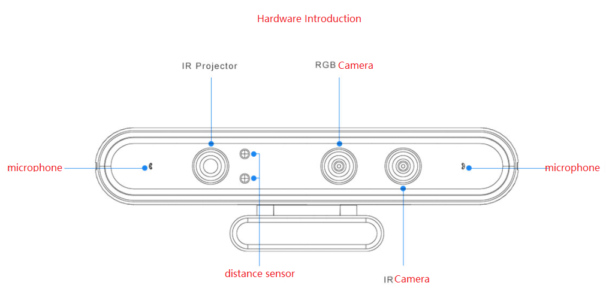
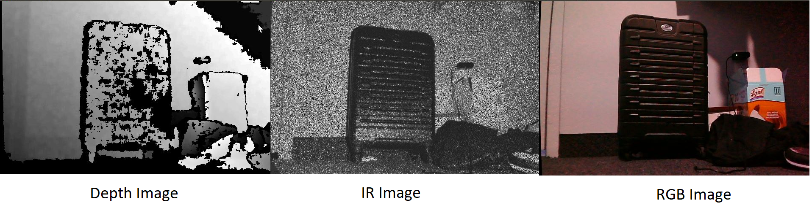
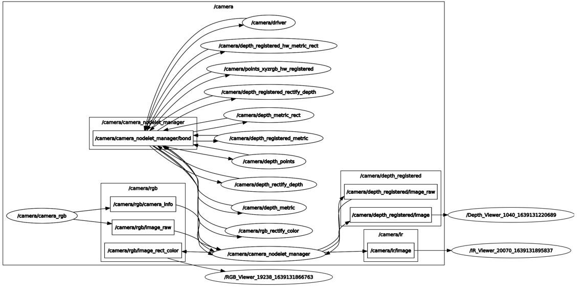
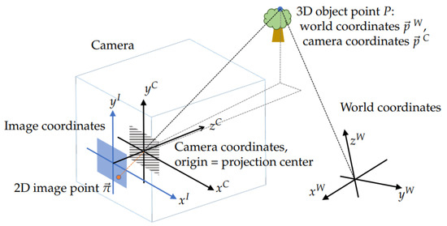
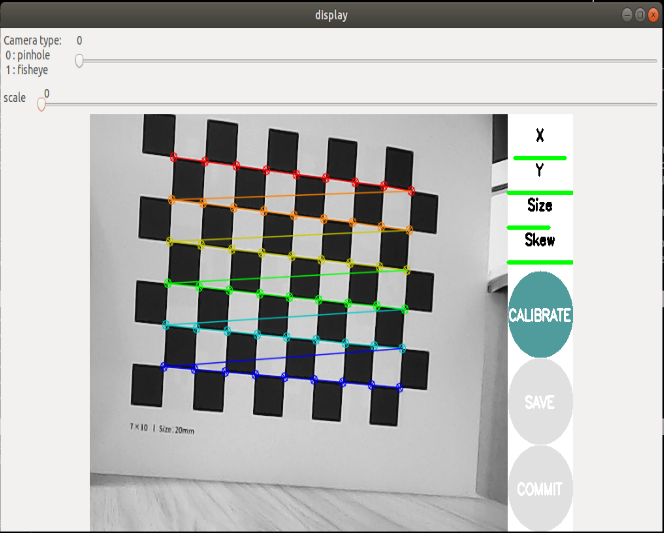

# RosMaster
# Introduction



Astra Camera has 

1. IR camera: for a gray IR image
2. RGB camera: for an RGB camera
3. IR projector and distance sensors: for a depth image
4. microphone

To capture the three kinds of images, we start by launching the vehicle with the Astra camera

```bash
roslaunch yahboomcar_nav astrapro_bringup.launch
```

To capture and display depth images, we should run 

```bash
rosrun astra_show  depth_viewer.py
```

To capture and display IR images, we should run 

```bash
rosrun astra_show  ir_viewer.py
```

To capture and display rgb images, we should run 

```bash
rosrun astra_show  rgb_viewer.py
```



## Rqt Graph



The **/camera** namespace contains all the nodes and topics for Astra Camera. The **/camera/camera_nodelet_manager** will start and stop the stream. The streaming is done trough the topics

- **/camera/ir/image**
- **/camera/depth_registered/image**
- **/camera/rgb/image_rect_color**

# Camera Calibration



Find the Matrix that perspective projection a point from the camera coordinate $\overrightarrow{p} ^w$ to the image point $\overrightarrow{\pi}$
. First, we run the core of the calibration process via

```bash
roslaunch yahboomcar_visual astra_calibration.launch
```

Next, we prepare The checkerboard used to calibrate the camera by [downloading](http://wiki.ros.org/camera_calibration/Tutorials/MonocularCalibration?action=AttachFile&do=get&target=check-108.pdf) and printing it, then mount it on a straight surface. To maintain the square shape, make sure that the aspect ratio is not changing by the printer. Measure the length of any square side.

To calibrate the RGB camera,  execute 

```bash
rosrun camera_calibration cameracalibrator.py image:=/camera/rgb/image_raw camera:=/camera/rgb --size 8x6 --square 0.03
```

where 

- size: the number of corner points in the chessboard that is supposed to be detected
- Square: the length of a square in the checkerboard in meters.
- image and camera: Set the topic of images posted by the camera.

This will open a window, the checkerboard will be recognized, and snapshots will be taken automatically in various positions and orientations. When the number of snapshots is satisfying, the calibration button will be activated ( colored in green) as shown in the next figure



Then, the result can be saved and committed to a specific path that will be accessed by the camera at its next launch

calibrating the IR camera goes through the same steps but with different parameters to the **cameracalibrator.py** node

```bash
rosrun camera_calibration cameracalibrator.py image:=/camera/ir/image_mono8  --size 8x6 --square 0.03
```
